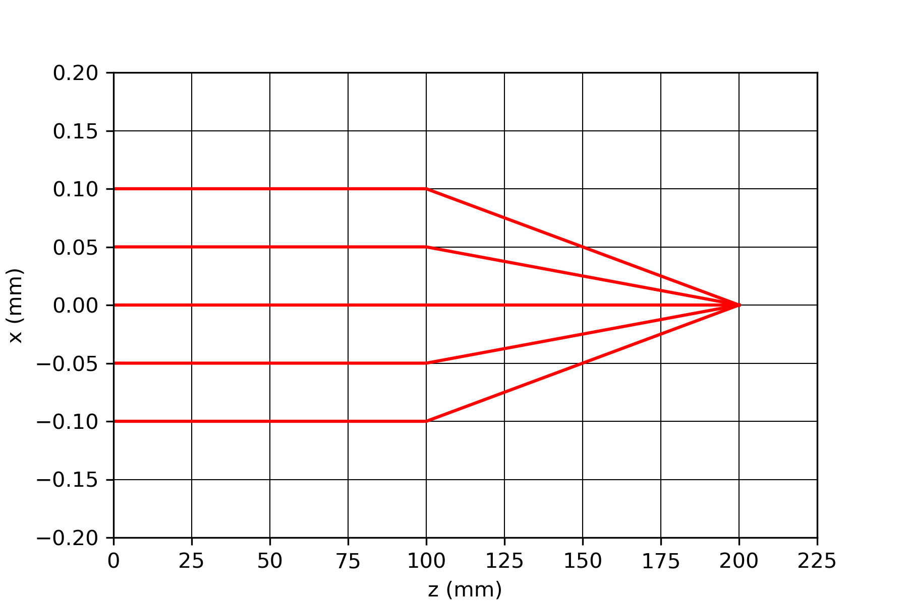
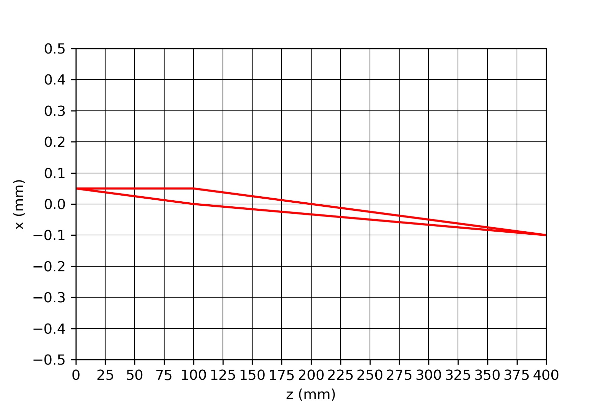
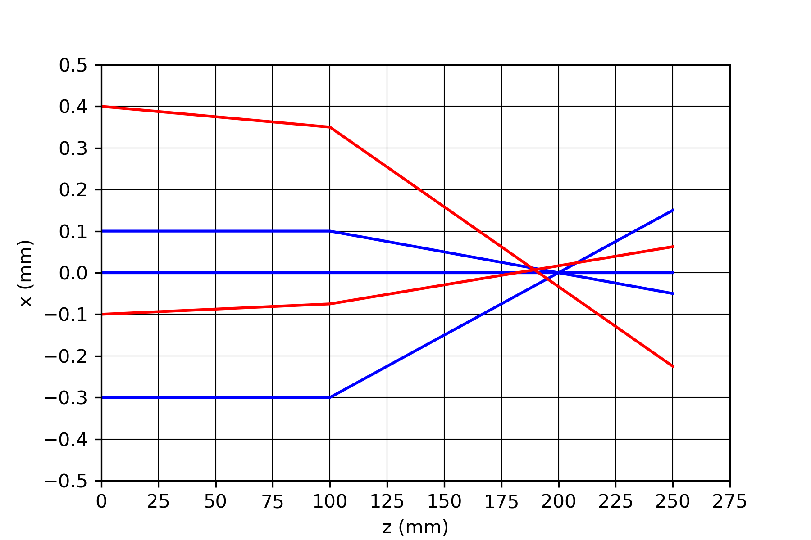
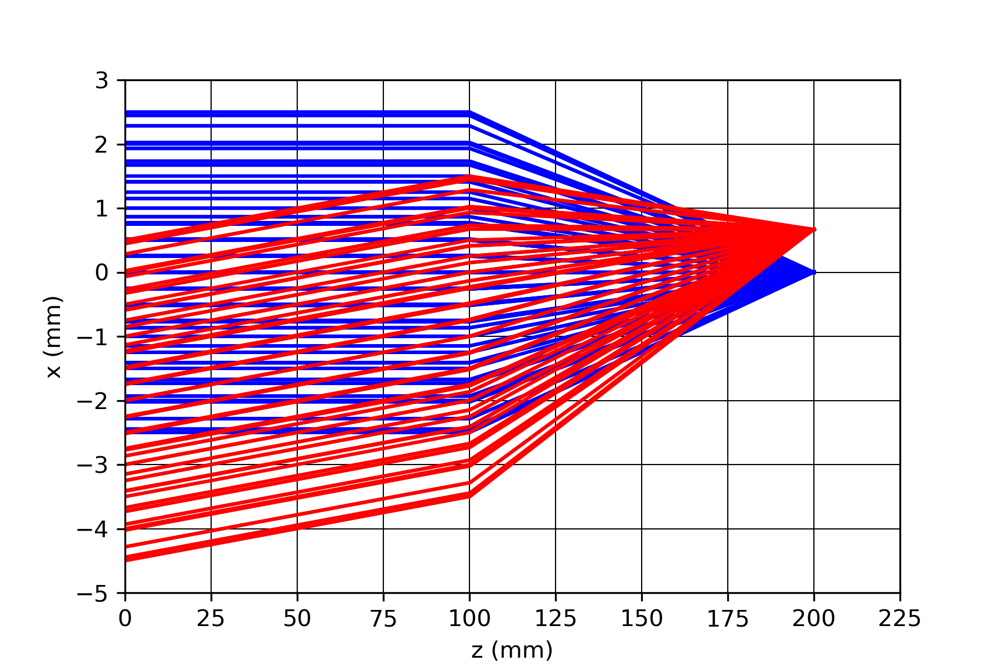
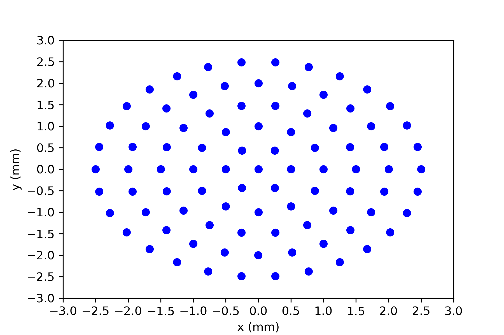
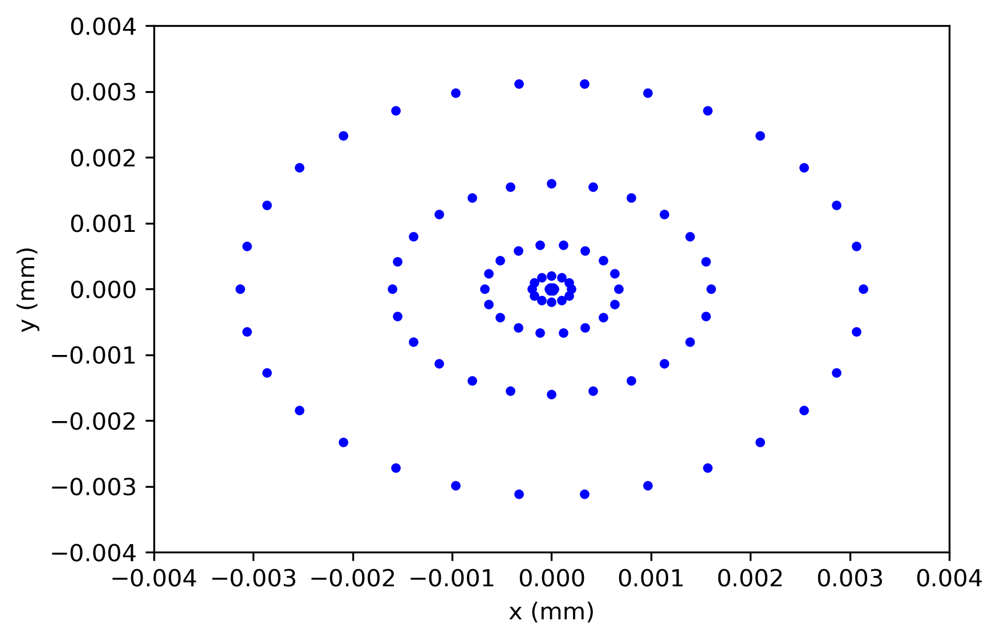
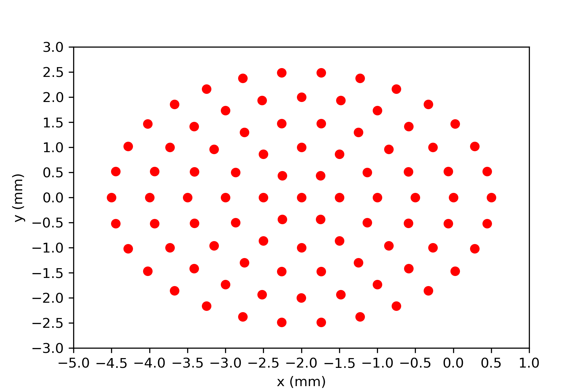
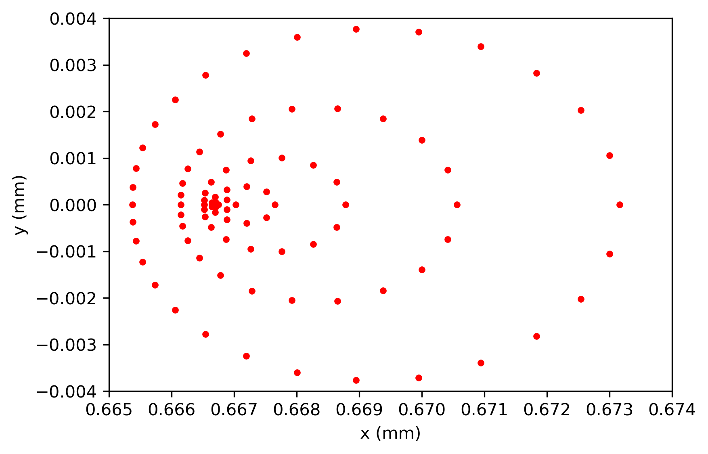

# OOP-modelling-3D-ray-tracer (Python)
## Project Overview
This project uses object-oriented programming (OOP) to model some optical systems involving bundles of rays
(both parallel and at an angle to the optical axis) and a spherical lens. My model was able to produce paraxial 
focuses that agreed with theoretical values, and through tracing the paths of ray objects, I was able to demonstrate spherical aberration present in the refraction of a uniform bundle of rays.

## Objectives
- Create classes to initialise ray and optical elements objects.
- Model the refraction of rays at angles and parallel to the spherical lens.
- Demonstrate spherical aberration in the result image of refracted rays.

## Methods
### 1. Creation of Modules
Four different modules were made that each contained a class for initialising different objects: a Ray class,
an OpticalElement class, a SphericalRefraction class (a derived class of OpticalElement), and an OutputPlane class
(also a derived class of OpticalElement).

### 2. Refraction Function
Geometric optics was used to form an intercept function for the SphericalRefraction class 
that was dependent on the curvature of the spherical lens.

### 3. Initialising Bundles of Rays
Two different bundles of rays were initialised, one where the rays are parallel to the optical axis (red) and one where they are parallel to the optical axis (blue).

### 4. Compare the Initial and Final Positions of Rays
I created two spot diagrams for each bundle: one at its initial position and one at its final position, after propagating and refracting through the lens.
More spherical aberration will be present if the spots are less precisely arranged about a single point.

Initial parallel bundle of rays positions:

Final parallel bundle of rays positions:

## Key Results
- The modelled paraxial focus position agrees with the theoretical values proposed using geometric optics
- Whilst spherical aberration is present for both bundles of rays, the angled bundle shows more spherical aberration. 

Initial angled bundle of rays positions:

Final angled bundle of rays positions:

## Tools & Technologies
- Python
- NumPy
- Matplotlib

## Key Techniques Demonstrated
- OOP through the creation of classes.
- Data visualisation
- Scientific model comparison

## How to Run the Model
1. Clone the repository:
github.com/Jack-Rice/OOP-modelling-3D-ray-tracer.git

2. Run the raytracer.py Python script.
